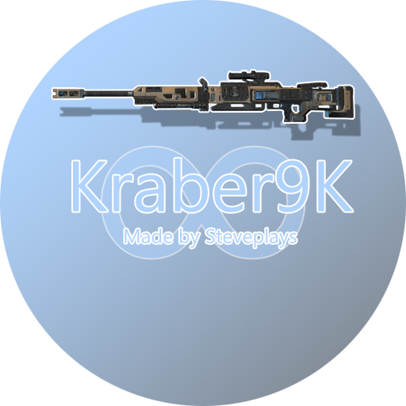
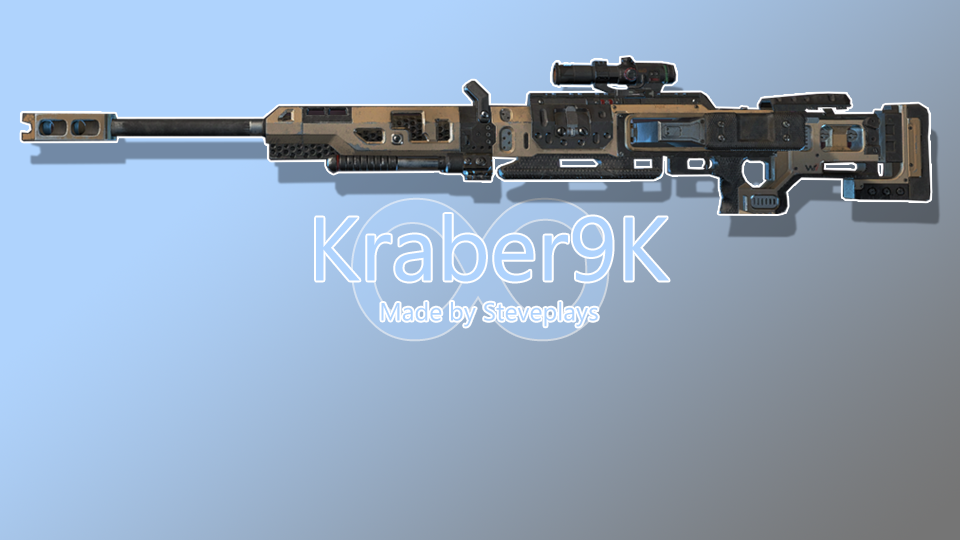

<h1 align="center">

Steveplays.HostHighlight

</h1>

## Description

Steveplays.HostHighlight is a Northstar mod that highlights the server host in the chat.

Screenshots - TODO: replace screenshots

 

## Installation

### Thunderstore

1. ~~Go to [the Thunderstore mod page](https://northstar.thunderstore.io/package/Steveplays/HostHighlight/)~~
2. ~~Press "Install with mod manager"~~

This mod is not available on Thunderstore yet. See: [FAQ](https://github.com/Steveplays28/HostHighlight#FAQ) & [Roadmap](https://github.com/Steveplays28/HostHighlight#Roadmap)

### Manual installation

1. Download the latest release from [GitHub](https://github.com/Steveplays28/HostHighlight/releases/latest) ~~or [Thunderstore](https://northstar.thunderstore.io/package/Steveplays/HostHighlight/)~~
2. Unzip `Steveplays.HostHighlight.zip`
3. Drag the unzipped folder into `Titanfall2/R2Northstar/mods/`

## FAQ

**Q: is this mod available on Thunderstore?**

A: No, this mod is not available on Thunderstore yet. See the badge at the top of the repoitory.

**Q: is this mod server side or client side?**

A: This mod is required only on the server side. See the badges at the top of the repository.

## Roadmap

- [ ] Upload mod to [Thunderstore](https://northstar.thunderstore.io) (ETA: unknown)
- [ ] Add the server host prefix to the leaderboard (ETA: unknown)
- [ ] Give the server host a cool color to make them stand out more (ETA: unknown)

## Bugs and suggestions

If you've found a bug or want to make a suggestions, feel free to [open an issue](https://github.com/Steveplays28/HostHighlight/issues/new)!

I will respond as soon as I can.

## My links

Feel free to contact me via any of these platforms, I respond quite quickly :)

